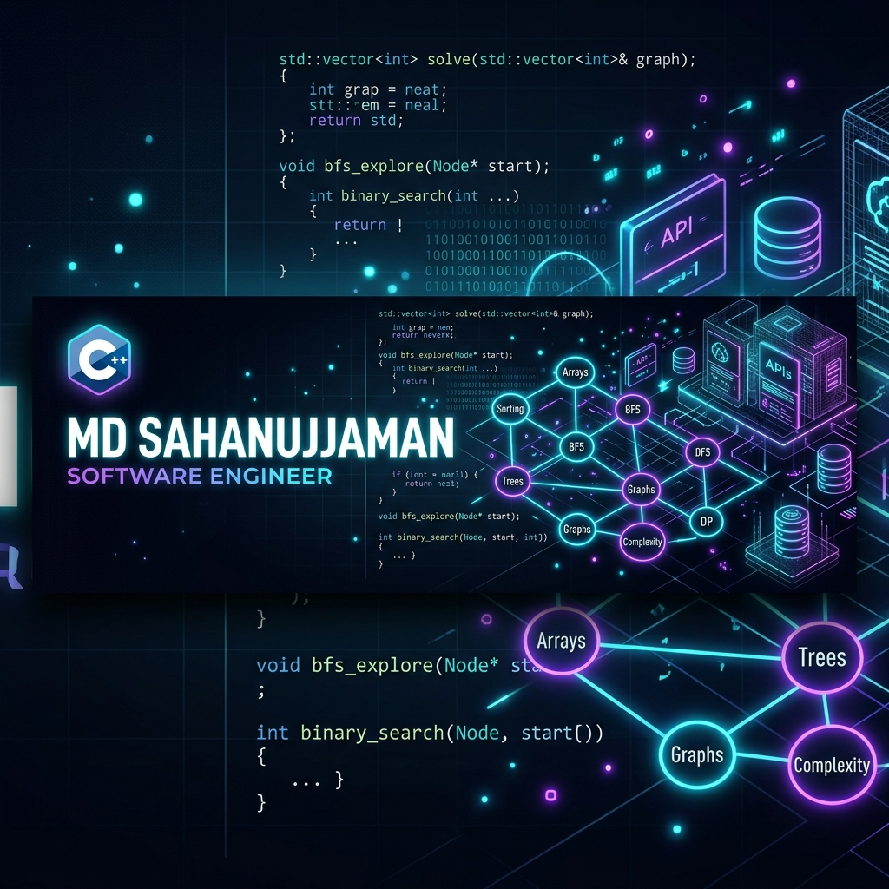

<div align="center">

<!-- Waving Capsule Header Banner -->


<!-- Header Banner Image -->


<br/><br/>

<!-- Typing SVG Header -->


<br/>

[](https://github.com/mdsahanujjaman)
[](https://github.com/mdsahanujjaman/Msjaman-PEP)
[](https://www.linkedin.com/in/mdsahanujjaman)
[](https://www.instagram.com/msjaman17)


*“Prepare until you are capable of facing any placement drive with deep knowledge, problem-solving mastery, and absolute confidence.”*

---

</div>

## 👤 Executive Profile Summary

```yaml
Developer: MD SAHANUJJAMAN
Academic Track: B.Tech in Information Technology (2023 - 2027)
Institution: Lovely Professional University (LPU), Jalandhar
Credential: Registered Pharmacist (WBSCTVESD) - SGP (2021 - 2023)
Core Competencies: C++, Data Structures & Algorithms, Core CS, Software Engineering
GitHub Profile: https://github.com/mdsahanujjaman
PEP Repository: https://github.com/mdsahanujjaman/Msjaman-PEP
```

---

## 🎯 Readiness Gauges & Track Completion

| Placement Track | Scope & Modules | Visual Completion Gauge | Status |
| :--- | :---: | :--- | :---: |
| 💻 **C++ Programming Track** | **38 Modules** | `[████████████████████]` **100%** | 🔥 Placement Ready |
| 🧠 **DSA Problem Solving Track** | **17 Topics** | `[████████████████████]` **100%** | 🔥 Placement Ready |
| 🗄️ **Core CS Fundamentals** | **6 Subjects** | `[████████████████████]` **100%** | 🔥 Placement Ready |
| 🛠️ **Software Engineering & Git** | **8 Modules** | `[████████████████████]` **100%** | 🔥 Placement Ready |
| 🎤 **Interview & HR Preparation** | **6 Modules** | `[████████████████████]` **100%** | 🔥 Placement Ready |

---

## 📌 Interactive Quick Navigation Dashboard

<table width="100%">
<tr>
<td width="50%" valign="top">

### 💻 [01_CPP](./01_CPP)
> **38 C++ Modules (Syntax to Advanced STL)**

- 📜 Foundations, Control Flow, Functions, Recursion
- 🧠 Pointers, Dynamic Memory, References
- 🏛️ OOP (Encapsulation, Inheritance, Polymorphism)
- 📦 STL Containers, Iterators & Algorithms
- 🔗 [`Explore C++ Track →`](./01_CPP)

</td>
<td width="50%" valign="top">

### 🧠 [02_DSA-Problem-Solving](./02_DSA-Problem-Solving)
> **17 Suchipatra Problem-Solving Topics**

- 🔢 Arrays, Strings, Searching & Sorting
- 🔗 Linked Lists, Stacks, Queues, Hashing
- 🌲 Trees, BST, Heaps & Priority Queues
- 🕸️ Graphs, Greedy, DP, Trie & Bitmasking
- 🔗 [`Explore DSA Track →`](./02_DSA-Problem-Solving)

</td>
</tr>
<tr>
<td width="50%" valign="top">

### 🗄️ [03_CS-Fundamentals](./03_Computer-Science-Fundamentals)
> **Core Computer Science Subjects**

- 💾 Database Management Systems (DBMS) & SQL
- 🖥️ Operating Systems (OS Kernel & Scheduling)
- 🌐 Computer Networks (OSI & TCP/IP)
- 🏛️ Object-Oriented System Design
- 🔗 [`Explore CS Fundamentals →`](./03_Computer-Science-Fundamentals)

</td>
<td width="50%" valign="top">

### 🛠️ [04_Software-Engineering](./04_Software-Engineering)
> **Engineering Tools & Best Practices**

- 🌿 Git Branching, Rebasing & Conflict Resolution
- 🔌 REST API Architecture, HTTP & JSON
- 🧼 SOLID Clean Code Principles & Testing
- 🔗 [`Explore Software Engineering →`](./04_Software-Engineering)

</td>
</tr>
<tr>
<td width="50%" valign="top">

### 💼 [05_Projects](./05_Projects)
> **Real-World Portfolio & Capstone Systems**

- 🚀 Msjaman-PEP Engine
- 🏥 Health Horizon (Telemedicine AI Platform)
- 🚍 NextStop (Real-Time Transit Tracker)
- ♻️ WasteWise (Plastic Waste Portal)
- 🔗 [`Explore Projects →`](./05_Projects)

</td>
<td width="50%" valign="top">

### ⚡ [09_CheatSheets](./09_CheatSheets)
> **High-Yield Quick Revision Guides**

- ⚡ C++ STL Containers & Algorithm Cheat Sheet
- ⏱️ DSA Time & Space Complexity Matrix
- 🗄️ SQL Command & JOIN Query Reference
- 🌿 Git Commands & Workflow Cheat Sheet
- 🔗 [`Explore Cheat Sheets →`](./09_CheatSheets)

</td>
</tr>
</table>

---

## 🏛️ Directory Architecture

```text
Msjaman-PEP/
│
├── 📜 00_README.md                    <- Primary Dashboard & Visual Guide
├── 🗺️ 01_MASTER_ROADMAP.md             <- Multi-Phase Execution Plan
├── 📊 02_PROGRESS_TRACKER.md          <- Topic & Problem Solving Dashboard
├── 📖 03_DAILY_JOURNAL.md             <- Daily Log of Progress, Learnings & Fixes
├── 🎯 04_GOALS.md                     <- Vision, Mission & 10 Placement Goals
├── 📚 05_RESOURCES.md                 <- Master Resource Directory
│
├── 💻 01_CPP/                         <- 38 C++ Modules (Syntax to STL)
├── 🧠 02_DSA-Problem-Solving/         <- 17 Suchipatra Topics + Mock Coding
├── 🗄️ 03_Computer-Science-Fundamentals/ <- DBMS, SQL, OS, CN, OOP, System Design
├── 🛠️ 04_Software-Engineering/         <- Git, REST API, JSON, Clean Code
├── 💼 05_Projects/                    <- Portfolio & Capstone Projects
├── 📄 06_Career/                      <- ATS Resume, LinkedIn, GitHub Profile
├── 🎤 07_Interview-Preparation/       <- Aptitude, HR, Technical & Mocks
├── 🌟 08_Personality-Development/     <- Soft Skills & Speaking Confidence
├── ⚡ 09_CheatSheets/                 <- High-Yield Revision Guides
├── 📚 10_Resources/                   <- Media & PDF Book References
└── 📦 11_Archive/                     <- Historical Notes & Code
```

---

## 🎯 Standard Module Architecture

Every study module across **01_CPP** and **02_DSA-Problem-Solving** follows a uniform layout:

```text
📁 Module-Folder/
├── 🖼️ Assets/                   # Visual diagrams, charts & screenshots
├── 📝 Assignments.md           # Hands-on practice problem statements
├── ⚡ CheatSheet.md            # Rapid revision notes & code snippets
├── ❓ Interview-Questions.md   # Top technical interview questions & answers
├── 📖 Notes.md                 # In-depth concept explanations
├── 📄 README.md                # Module outline & learning objectives
├── 🔄 Revision.md              # Key takeaways & quick review points
├── 💻 Examples.cpp             # Clean, well-commented sample code
└── 🧪 Practice.cpp             # Workspace for custom solutions & practice
```

---

## 💡 Daily Workflow System & Rules

1. **Learn & Document:** Read theory & log core findings in `Notes.md`.
2. **Code & Implement:** Write clean C++ code in `Examples.cpp` & `Practice.cpp`.
3. **Log & Fix Errors:** Record edge cases and bugs in `03_DAILY_JOURNAL.md`.
4. **Update Tracker:** Mark completed topics in `02_PROGRESS_TRACKER.md`.
5. **Rapid Revision:** Review `CheatSheet.md` and `Revision.md` periodically.

---

<div align="center">

**Created & Maintained by [MD SAHANUJJAMAN](https://github.com/mdsahanujjaman)**  
*B.Tech Information Technology • Lovely Professional University (LPU)*  
*Keep grinding, keep building, and earn your dream placement!* 🏆

<br/>


</div>
